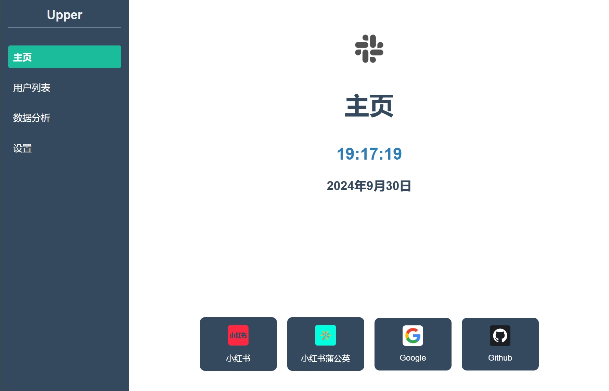
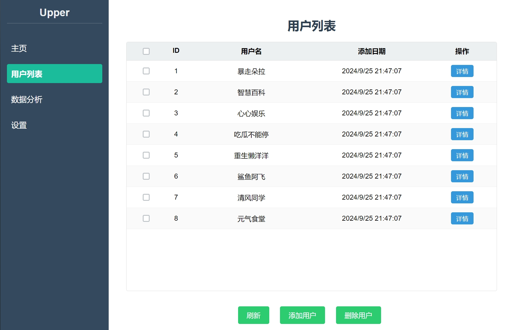
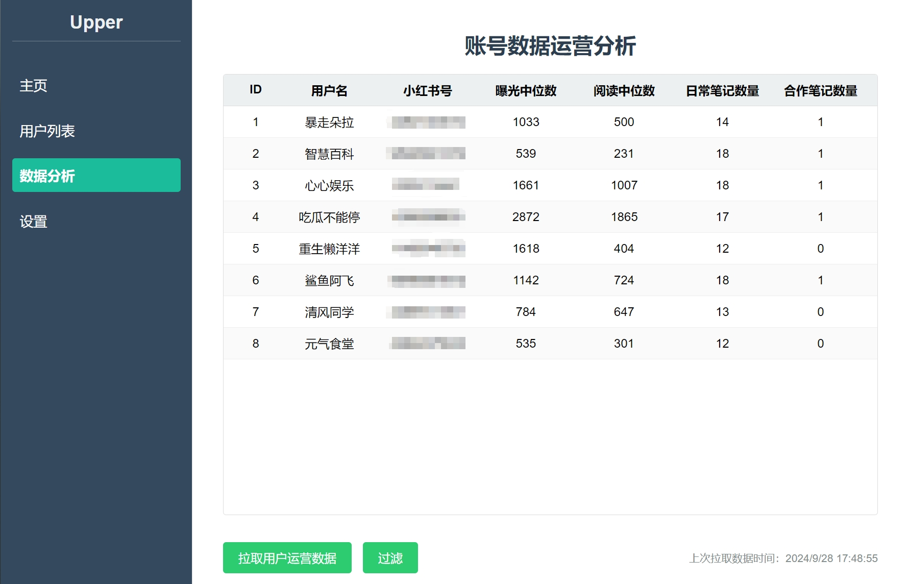
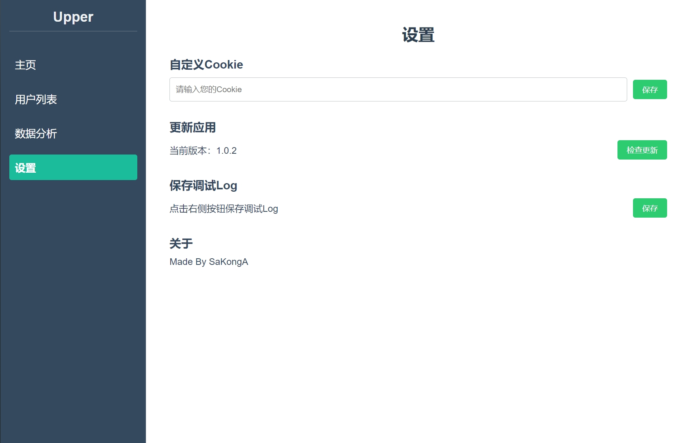

<div align="center">


<h1 align="center">Upper</h1>

一个简洁的小红书蒲公英账号运营批量概览程序
</div>

## 下载
* 请前往[Github Release](https://github.com/SaKongA/Upper/releases)下载最新预构建版本。

## 构建
0. 确保设备已经安装[Node.js](https://nodejs.org/)
1. 安装项目所需依赖
```bash
> npm install
```
2. 临时启动项目
```bash
> npm start
```
3. 构建项目包
```bash
> npm run build
```

## 特性
* 使用[Electron](https://github.com/electron/electron)开发，开发、构建简便快捷，UI简洁、友好；

* 支持从XLSX表格中导入用户，支持通过UserID与TraceID手动导入用户；

* 目前支持拉取小红书号、曝光中位数、阅读中位数、日常笔记数量、合作笔记数量一键拉取；

* 支持远程更新程序；

* 更多特性，正在陆续更新...

## 截图
<div align="center">
	
    
    
    
</div>

## 支持
* 欢迎前往[Issue](https://github.com/SaKongA/Upper/issues)提出您遇到的任何问题；
* 如果您对我的项目感兴趣，需要更多帮助与支持，再或需要完善其他功能，欢迎联系我！

## 声明
* 本项目仅供学习交流使用，由于不正当使用程序等造成的一切责任与本人无关！